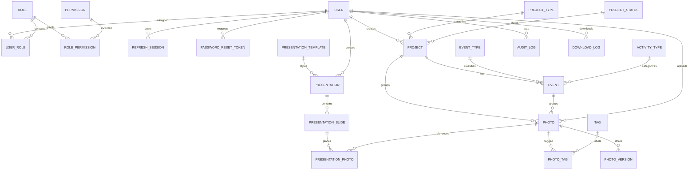

# Entity relationship diagram

```mermaid
erDiagram
  USER ||--o{ USER_ROLE : assigned
  ROLE ||--o{ USER_ROLE : contains
  ROLE ||--o{ ROLE_PERMISSION : grants
  PERMISSION ||--o{ ROLE_PERMISSION : included
  USER ||--o{ REFRESH_SESSION : owns
  USER ||--o{ PASSWORD_RESET_TOKEN : requests
  USER ||--o{ PROJECT : creates
  PROJECT_TYPE ||--o{ PROJECT : classifies
  PROJECT_STATUS ||--o{ PROJECT : states
  PROJECT ||--o{ EVENT : has
  EVENT_TYPE ||--o{ EVENT : classifies
  ACTIVITY_TYPE ||--o{ EVENT : categorizes
  PROJECT ||--o{ PHOTO : groups
  EVENT ||--o{ PHOTO : groups
  USER ||--o{ PHOTO : uploads
  PHOTO ||--o{ PHOTO_VERSION : stores
  PHOTO ||--o{ PHOTO_TAG : tagged
  TAG ||--o{ PHOTO_TAG : labels
  PRESENTATION_TEMPLATE ||--o{ PRESENTATION : styles
  USER ||--o{ PRESENTATION : creates
  PRESENTATION ||--o{ PRESENTATION_SLIDE : contains
  PRESENTATION_SLIDE ||--o{ PRESENTATION_PHOTO : places
  PHOTO ||--o{ PRESENTATION_PHOTO : references
  USER ||--o{ AUDIT_LOG : acts
  USER ||--o{ DOWNLOAD_LOG : downloads
```

Deletion is soft for institutional records. Physical media removal is an administrator retention operation and must be audited.
